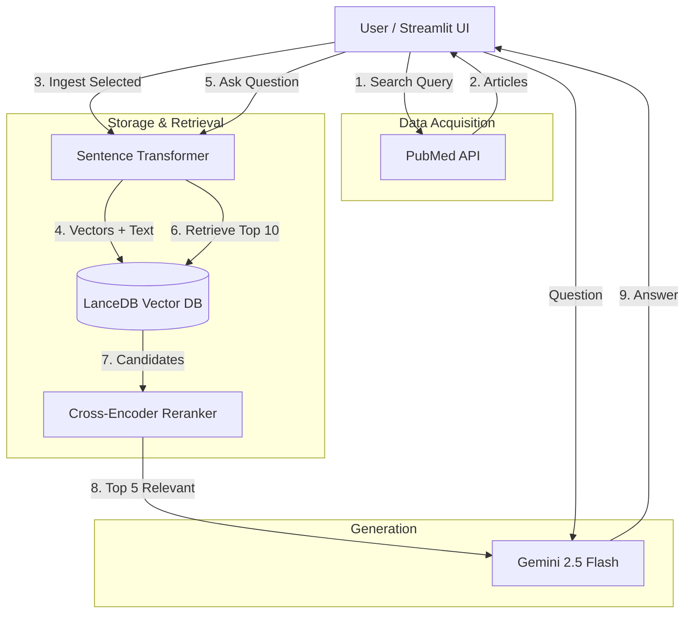

# PubMed Assistant

A Streamlit application that allows users to search PubMed for medical articles, ingest them into a local vector database, and ask questions using a Retrieval-Augmented Generation (RAG) approach powered by Google's Gemini model.

## Features

- **Search & Ingest**: 
  - Search PubMed for articles using keywords.
  - Configurable number of articles to fetch (1-50).
  - View abstracts and links to original articles.
  - Ingest selected articles into a local LanceDB vector database.
- **Chat with Knowledge Base**:
  - Ask natural language questions about the ingested articles.
  - Get answers generated by Gemini 2.5 Flash, grounded in the retrieved context.
  - View source references for every answer.
- **Configuration**:
  - Securely load Gemini API Key from `.env` file or enter manually.
  - Persistent vector database storage.

## Approach

### Architecture



### 1. Data Acquisition (PubMed)
The app uses `Biopython` (`Bio.Entrez`) to interact with the PubMed API.
- **Search**: Retrieves PubMed IDs (PMIDs) based on the user's query.
- **Fetch**: Retrieves detailed metadata (title, abstract, authors, year) for the list of PMIDs.

### 2. Vector Database (LanceDB)
We use `LanceDB` as a lightweight, serverless vector database.
- **Embedding**: The **`all-mpnet-base-v2`** model (768 dimensions) is used to create high-quality vector embeddings of the article content.
- **Storage**: Articles and their embeddings are stored locally in `data/lancedb`.

### 3. Advanced RAG Engine
The `RAGEngine` class implements an advanced retrieval pipeline:
- **Ingestion**: Embeds text using the MPNet model and inserts it into LanceDB.
- **Retrieval**: Performs semantic search to find the top 10 candidate articles.
- **Reranking**: Uses a **Cross-Encoder** (`ms-marco-MiniLM-L-6-v2`) to re-score candidates based on their relevance to the specific question, selecting the top 5.
- **Generation**: The highly relevant context is passed to Google's **`gemini-2.5-flash`** model to generate a precise answer.

## Installation

1. **Clone the repository**:
   ```bash
   git clone <repository-url>
   cd pubmed_rag_app
   ```

2. **Install dependencies**:
   ```bash
   pip install -r requirements.txt
   ```

3. **Set up Environment Variables**:
   Create a `.env` file in the root directory and add your Google API Key:
   ```env
   GOOGLE_API_KEY=your_api_key_here
   ```

## Usage

1. **Run the Streamlit app**:
   ```bash
   streamlit run app.py
   ```

2. **Navigate**:
   - Go to **Search & Ingest** to build your knowledge base.
   - Switch to **Chat** to ask questions.

## Requirements

- Python 3.9+
- Streamlit
- LanceDB
- Google Generative AI SDK
- Biopython
- Sentence Transformers
