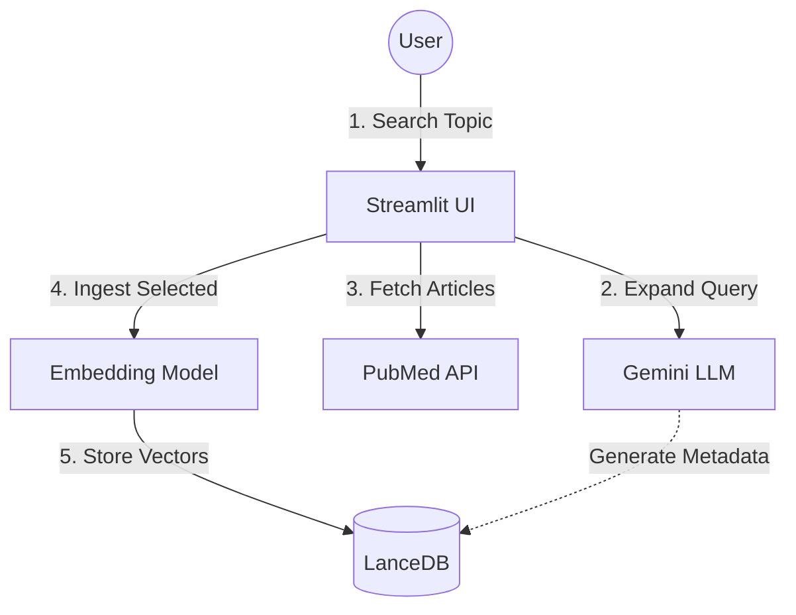
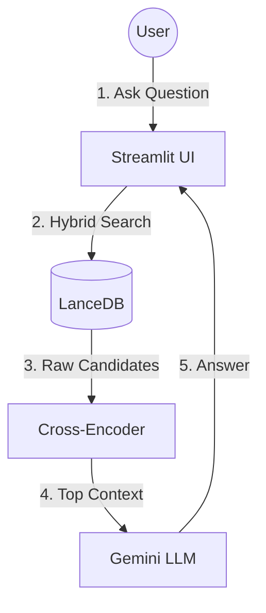
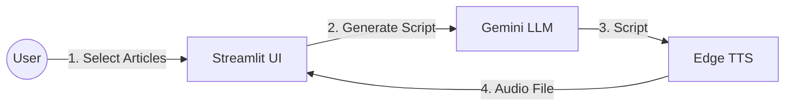

# 🧬 PubMed RAG Assistant


A powerful, AI-driven research assistant designed to supercharge medical literature review. This application allows researchers to search PubMed, build a local knowledge base, and perform advanced analysis using Retrieval-Augmented Generation (RAG) powered by Google's Gemini 2.5 Flash model.

## 🌟 Key Features

### 🔍 Intelligent Search & Ingestion
*   **Smart Query Expansion**: Automatically enhances your search terms with medical synonyms (e.g., "heart attack" → "myocardial infarction") to ensure you never miss relevant papers.
*   **Seamless Ingestion**: Download and index articles directly into a local vector database for permanent access.
*   **Data Export**: Export your search results and knowledge base to CSV for external analysis.

### 🧠 Advanced RAG & Analysis
*   **Context-Aware Chat**: Ask natural language questions. The system retrieves the most relevant excerpts from your ingested articles to provide grounded, accurate answers with citations.
*   **Automated Insights**:
    *   **TL;DR Summaries**: One-sentence summaries generated for every article.
    *   **PICO Extraction**: Automatically extracts **P**opulation, **I**ntervention, **C**omparison, and **O**utcome from clinical abstracts.
    *   **Categorization**: Auto-tags articles by type (e.g., Clinical Trial, Review, Case Study).

### 🎙️ Audio & Visualization
*   **AI Podcast Generator**: Turn your reading list into a listening experience. Generates a realistic, 2-minute "podcast" summary of your top articles using **Edge TTS** for natural-sounding voiceovers.
*   **Interactive Knowledge Graph**: Visualize the network of research, connecting papers by shared authors to uncover collaboration patterns.
*   **Semantic Discovery**: "More Like This" feature finds semantically similar papers instantly using vector embeddings.

## 🏗️ Architecture

The system uses a **Hybrid Search** approach, combining semantic understanding with keyword precision, followed by a re-ranking step for optimal relevance.

## 🏗️ Architecture

The system is built on three main workflows:

### 1. Search & Ingestion Pipeline
How articles are found and stored in the knowledge base.



### 2. RAG Retrieval Flow
How the system answers questions using the stored knowledge.



### 3. Podcast Generation
How the audio summaries are created.



### Technical Stack
*   **LLM**: Google Gemini 2.5 Flash
*   **Vector Database**: LanceDB
*   **Embeddings**: `all-mpnet-base-v2` (768 dimensions)
*   **Reranker**: `cross-encoder/ms-marco-MiniLM-L-6-v2`
*   **Text-to-Speech**: Edge TTS (Microsoft Edge's Neural Voices)
*   **Frontend**: Streamlit

## 🚀 Getting Started

### Prerequisites
*   Python 3.9 or higher
*   A Google Cloud API Key (for Gemini)

### Installation

1.  **Clone the repository**
    ```bash
    git clone <repository-url>
    cd pubmed_rag_app
    ```

2.  **Install dependencies**
    ```bash
    pip install -r requirements.txt
    ```
    *Note: You may need to install `edge-tts` separately if it's not in requirements yet.*

3.  **Configure API Key**
    Create a `.env` file in the root directory:
    ```env
    GOOGLE_API_KEY=your_actual_api_key_here
    ```

### Running the App

```bash
streamlit run app.py
```

Once running, navigate to **http://localhost:8501** in your browser.

## 📖 Usage Guide

1.  **Search & Ingest Tab**:
    *   Enter a medical topic (e.g., "immunotherapy for lung cancer").
    *   Review the search results.
    *   Select articles of interest and click **"Ingest Selected Articles"**. This saves them to your local knowledge base.

2.  **Chat Tab**:
    *   **Chat**: Ask questions like "What are the main side effects mentioned in the trials?" or "Compare the outcomes of Drug A vs Drug B."
    *   **Podcast**: Select articles and click "Generate Podcast Summary" to hear an audio overview.
    *   **Explore Articles**: Browse your database, filter by keywords, and view PICO analyses.
    *   **Knowledge Graph**: Switch to the graph view to see how authors and papers are connected.

## 🤝 Contributing

Contributions are welcome! Please feel free to submit a Pull Request.

## 📄 License

[MIT License](LICENSE)
